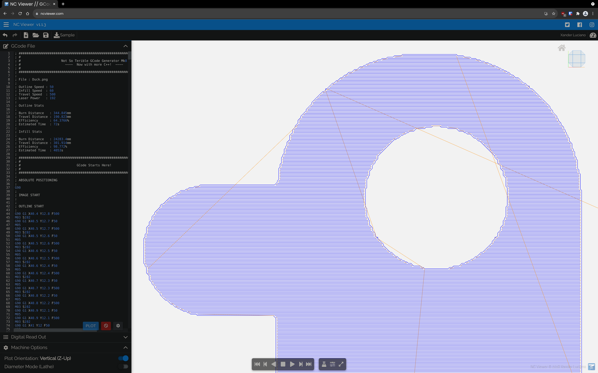

## CNC Laser GCode Generator

I finally got around to updating my old version, by writing it this time in C++.  It's a bit faster but still needs a lot of work.

I'll get around to 'finishing' (when is a project ever finished?) it over the next few days  and weeks once I can run the files on my home-made CNC Laser (more like forget about it for 3 years, oops).

### Running it

You'll need a C++ compiler, the ImageMagick libraries, and more patience than you can wave a stick at.

The included TOML header is from [ToruNiina/toml11](https://github.com/ToruNiina/toml11) and is version 4.4.0.

### Output

Can be seen in raw form in `/gcode` but also below .. dun dun dunnn!

